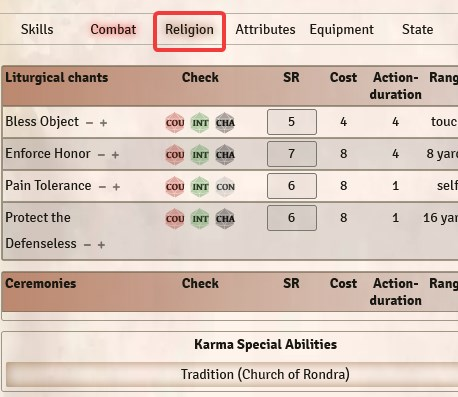
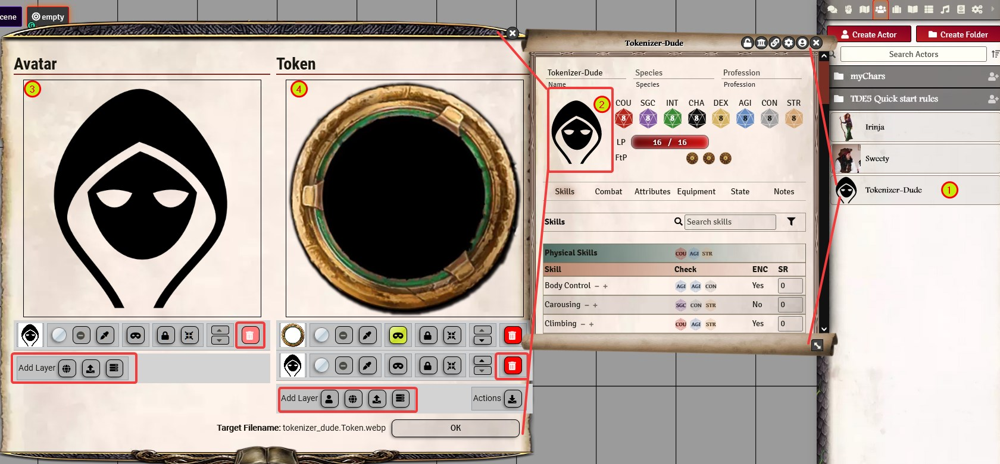
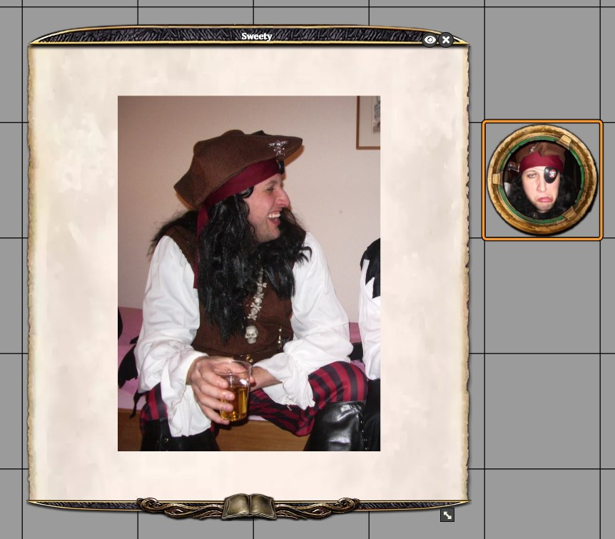

# Character creation
**Attention**: There are still one or two bugs, which is why it's currently recommended to create the character externally and then transfer it to Foundry manually.
The character creation is relatively modular.  
To make it easier, you should roughly follow the flow of the basic rulebook, even tough there are some additional steps which have to be done in Foundry only.  
The chapters with (game master) can only to be carried out by the game master when the Foundry permission settings are set to the standard options.

**Note:** If you are looking for a external tool to create (and maintain) your characters, check out the [ressources section.](en-ressources)

1. [Create character (game master)](#1-create-character-game-master)  
2. [Enter experience](#2-enter-experience)  
3. [Choose species](#3-choose-species)  
4. [Choose culture](#4-choose-culture)  
5. [Distribute attribute points](#5-attribute-points)  
6. [Select Profession](#6-choose-profession)  
7. [Choose advantages and disadvantages](#7-select-advantages-and-disadvantages)  
8. [Make increases](#8-improvements)  
9. [Choose special skills](#9-choose-special-abilities)  
10. [Final adjustments (notes, equipment, name)](#10-final-adjustments)  
11. [Portrait and token images (game master)](#11-portrait-and-token)  

Here you can find the whole thing as a video (german only): [Character creation](https://www.youtube.com/watch?v=NrqvByX3da0)

## General informations before we start
### [Using content from the library](en-library)
### [Create your own content (spells, special skills, equipment, etc.)](en-create-personal-entries)

## 1. create character (game master)
### The game master must create a character using the Actors menu:
1. create actor
2. set name, type "Character" and click on "create new" actor

### If the player should be able to edit and maintain his character (recommended), we have to adjust the permissions:
1. right click on the character  
2. configure permissions  
3. select the permission *owner* for the corresponding player  
4. save changes  
  

Now the player can edit this character himself.

## 2. enter experience
The experience (in form of adventure points) is entered on the character sheet, in the *Attributes* tab.   
  

If this step is skipped, there will be a query for the experience level (when adding the first item that costs AP), which then will add the right amount of adventure points to the sheet.  

## 3. choose species
After the species has been [dragged onto the character sheet](en-library), a window opens with the following tabs/information:
1. **Description**: Information, Flufftext and background information about the species  

2. **General**: Selection of trait changes. Note: This does NOT change your attribute values, but it changes the allowed maximum values for these attributes, according to TDA rules for character generation.  

3. **Advantages/Disadvantages**: The recommended or suitable advantages/disadvantages can be selected directly via check marks. They are then assigned to the character and costs (AP) are calculated accordingly.  

Based on your selections, the derived values are calculated (Life points, movement, initiative etc).  
They will automatically be updated when you change the character values later on (attributes, dis-/advantages, special abilities etc.), but please note that you **can't change the species after you set it**.  

## 4. choose culture
The culture is also simply dragged onto the character sheet. Tabs and information are similar to the [species](#3-choose-species) and the same rules apply.
Differences are:
1. Some entries are pre-selected and can't be de-selected (like languages)
2. Area Knowledge is a must-have entry. You can write any bogus entry and change it later if you don't know that detail right now.
3. You can get rid of must-have entries after character creation if they don't fit your char concept. Have an eye on your AP before you do that, and correct the values afterwards if necessary.  

## 5. attribute points  
In the Attributes tab, you can change the values by using the + and - buttons.  
**If you enter the values directly into the fields, there is no AP calculation. If you use the + / - buttons, there is AP calculation.**  

**CAUTION**: Currently, the attributes are not monitored or restricted according to the rules. This means that you can level them higher than the experience level, species or dis-/advantages would allow. The total points (usually 100 points for experience level "Experienced") are not checked, either.    

## 6. choose profession  
You should get the hang of it by now:  
1. choose a profession in the library, drag & drop it onto the character sheet.  
2. you receive some must-have entries, and you can select additional entries which are recommended by the TDE system.  
3. **Alternatively,** you can skip this step completely and create your own profession. Just write its name and then set skills, special abilites etc. as you see fit (Remember: Professions are just a collection of values and abilities, regularly paid with AP).   

## 7. select advantages and disadvantages
Next, additional advantages and disadvantages for the character can be pulled from the library.  
Some entries allow different levels (like "Luck", "Darksight", "Good Looks" etc.). You can recognize them easily, because they have a number (roman numeral) behind them, even if they are only on level 1.  
To change the level, assign the dis-/advantage to the char. Then click to open it, and change the level in the tab "Details" tab of the entry (by using + and -).  

## 8. Improvements
Change the values for skills, combat techniques, spells, liturgies etc.
1. **Use the + / - buttons** for AP calculation (as always)
2. You can buy Life / Karmal Energy / Astral Energy points, too
3. For combat techniques, you see the derived base values as well  
  
  
  

## 9. Choose special abilities
Special abilities can also be dragged from the library into the character sheet. They will then be listed where they belong by type:
* General special abilities, languages, writings, fate point abilities -> Attributes Tab  
  *  
* Clerical abilities, traditions -> Religion Tab  
  *   
* Magic  abilities, traditions -> Magic Tab  

  *    
* Combat abilities -> Combat Tab  
  *  

## 10. Final Adjustments
Time for the finetuning, so lets make sure to check or change:
 * **Name of the character and token**. Open the sheet via character menu (not by clicking on the token). Change the name in the top left corner. Then, change the name you want to display on your token by accessing the Prototype Token Config in the top right corner.
 * **Notes** You  can add a Bio, additional notes and stats on the "Notes" Tab. There is a separate field for GM notes, and only players with higher permissions can see them. See [this page](en-charactersheet#5-equipment) for more info on that.
 * **Equipment** You can add single items or packages to your chars inventory. Please check [this page](en-charactersheet#7-notes) for detailed information about that process. Most importantly: If you want to use a weapon or armor, you have to equip it. To do so, tick that little circle in the "worn" column. 

## 11. Portrait and token  
**There are 2 different approaches to this, either with or without additional module "Tokenizer" installed**  

###  1. Foundry only, without module  
  
#### 1.1 Character artwork / image  
1. Open your character via menue (**not** via token)
2. Click on the generic image below the characters name and a window will pop up. You can upload an image file from your computer and choose where to store it, or you can select an image already stored in the foundry directory. Always use the USER DATA area to store own content, not the CORE DATA area. Save the changes with "Select File".  
  
#### 1.2 Token artwork / image
3. Open the Prototype Token Configuration. Switch to the "Image" Tab. Klick the symbol next to the "Token Image Path" field to pop up a window which lets you upload/select the file you want to use as the token image. This will be visible when you drag the character onto a scene background.
  
  
### 2. With "Tokenizer" module installed and enabled  
  
#### 2.1 Character AND token artwork / image  
With the module installed, you set both images in one step, with more options.  
**Editing Layers**: drag (click and drag), zoom (mousewheel), rotate (shift+mousewheel)

1. Open your character via menue (**not** via token)  
2. Click on the generic image below the characters name and the Tokenizer window will pop up.
3. On the left side, you can set the character image first.
  - Add Layer(s): You can add images by entering a URL, upload it from your computer, or select one stored in Foundry already.
    - You could add several layers (with transparency) and mix them
    - Sort them with the arrow up/down buttons if needed
    - Click the lock-symbol of a layer to unlock and edit it if needed
  - Delete the base layer  
  
4. Now we can set the token image on the right side  
  - Add Layers(s)  
    - You can add the avatar image from the left side as layer for the token image (plus the other options URL/upload/server-folder as well)  
  - Delete layers you dont need anymore. DON'T DELETE THE RING, that's the frame we need.  
  - Sort the layers, so the ring is on top  
  - Unlock and edit the layers below the ring until you are satisfied  
  - Click OK to save the images  
  
  
  
  

*Translation information*  
*[x] updated: 2021-06-09*  
*[x] german entry [linked](https://github.com/Plushtoast/dsa5-foundryVTT/wiki/de-Charaktererstellung)*  
*[x] automatic translation*  
*[x] proof read*  
*[x] change pictures with EN version*  
